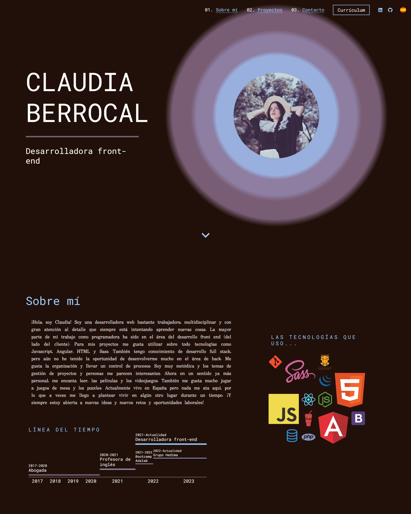
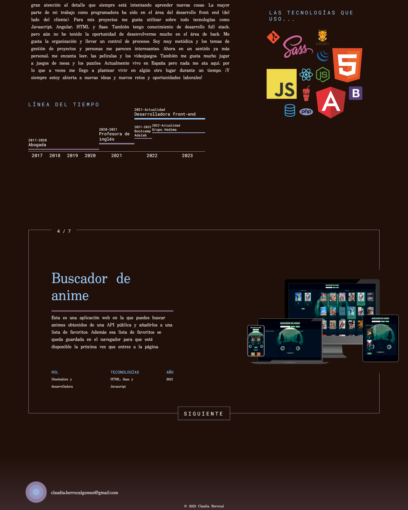
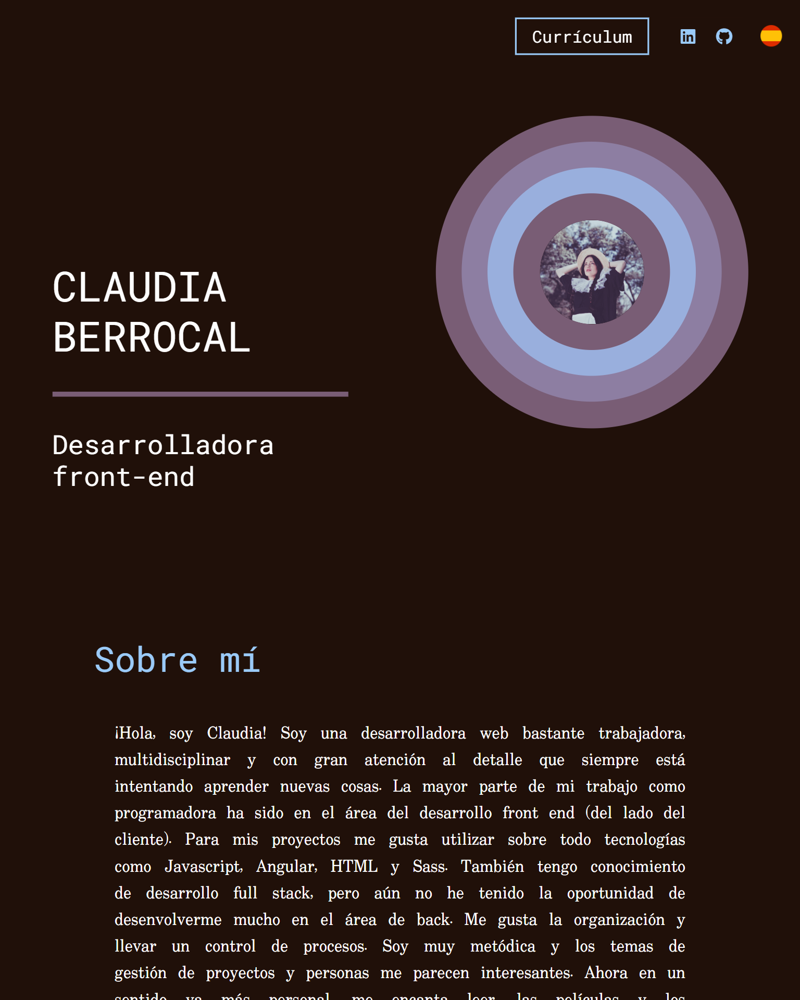
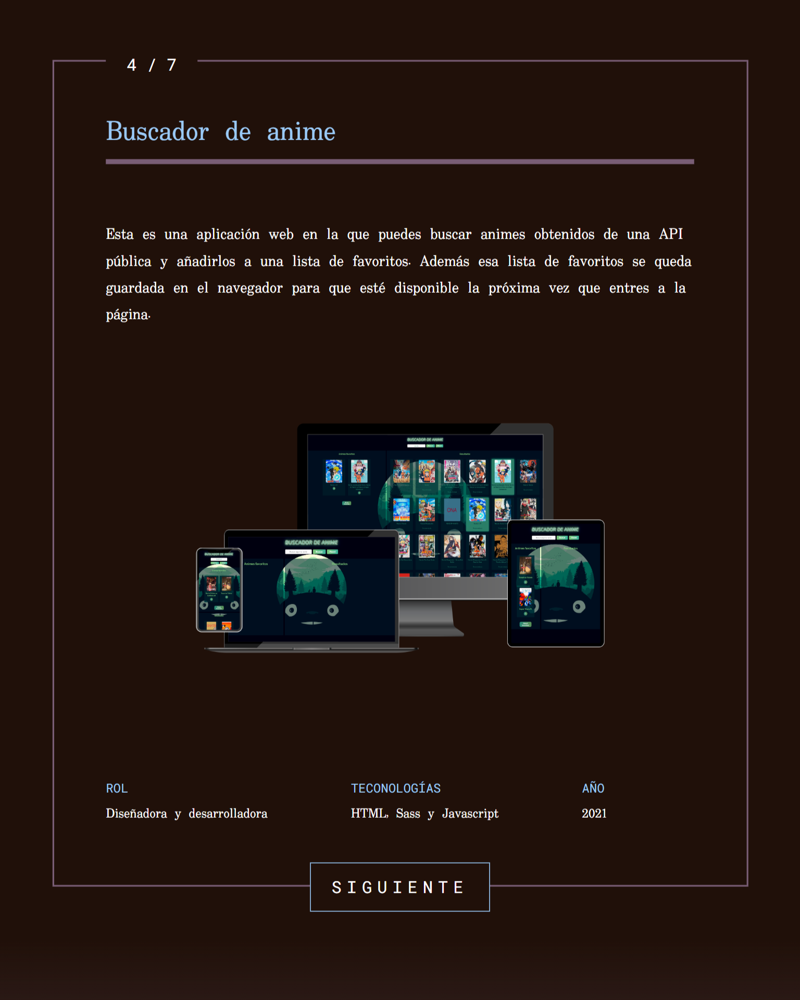
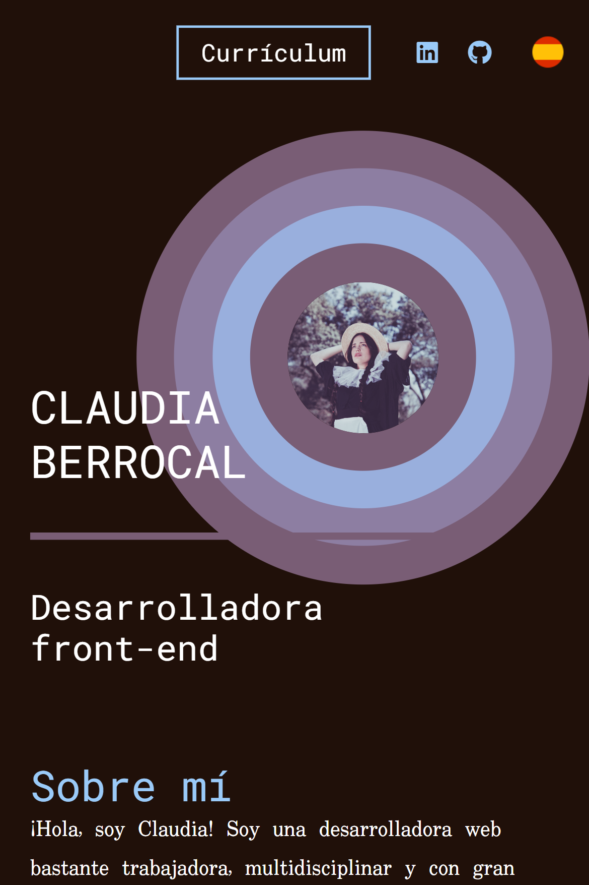
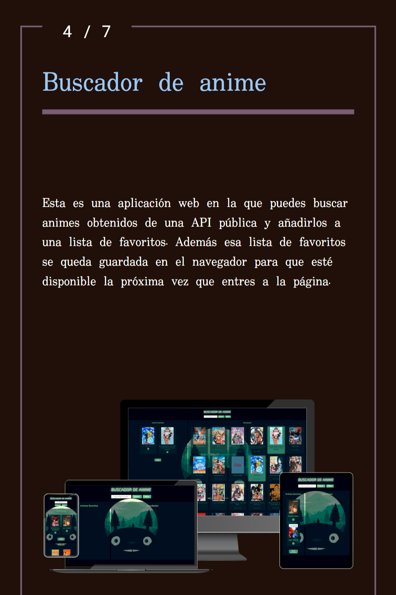

# My developer portfolio

This a web page for you, to get an idea of my past experience and the projects I've been working on in the past.

This portfolios has been generated with Angular v 13.3.4. 

I chose this specific framework because I was using it in my work place and I wanted to practice it since that was the only way I had to learn more and more about it and apply everything I learned from it on my work projects. 

I also used Sass and Html for the styling.

The page is using two languages, spanish and english, and depending on your navigator language the page loads in one language or the other. This was a big challenge to me because I really wanted to approach as many people as I could.

## How to view the project

Simply click on the link provided on the "about" section on the top right of the screen and you can see the web in any device of your choice

## Responsive design

As I just said, you can view the project in any device that you prefer. This is thanks to its responsive design that allows you to see everything correctly anywhere, any time.

Just in case you feel the urge to enjoy my web page and you don't have a PC around.

This is the aprox view you will get depending on the device:

For PC:

  
  

For tablet:

  
  

For mobile:

  
  

---

## Enjoy the ride!

